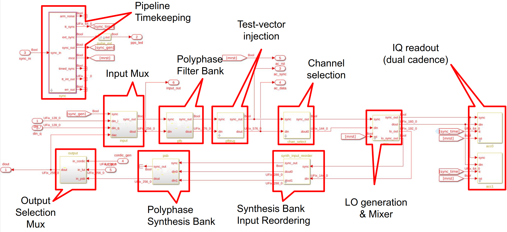
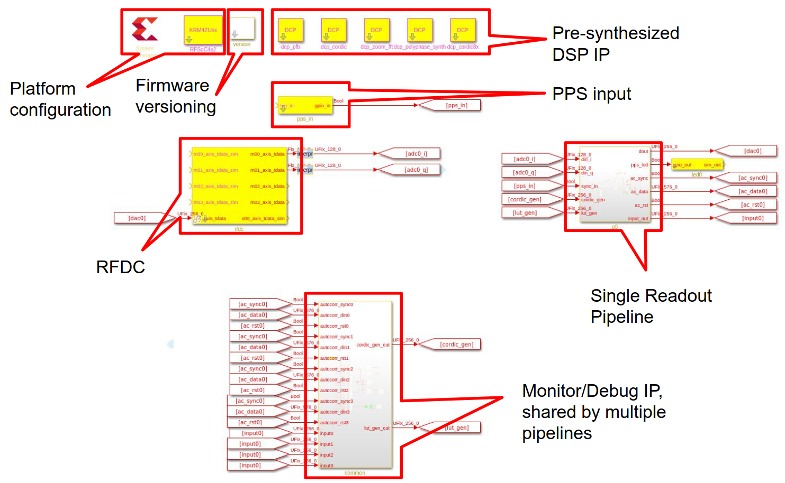
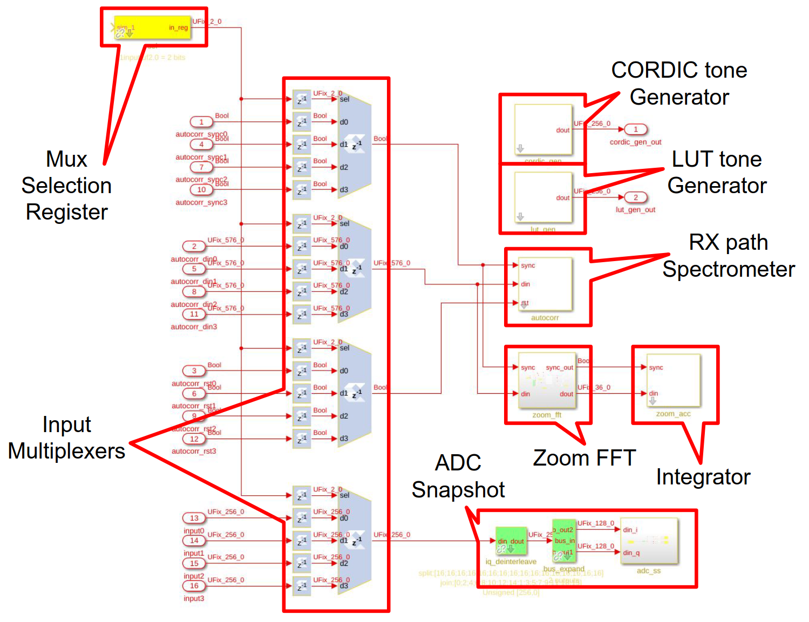

F-Engine System Overview
========================

Overview
--------

The SOUK MKID readout system is built around multiple instances of a single readout pipeline.
Each pipeline has the following capabilities:

  1. Digitize a single RF data stream at 5 Gsps (real-sampled).
  2. Channelize the resulting 2.5 GHz Nyquist band into 8192 channels each of 610 kHz width, and overlapping by 50%.
  3. Select 2048 of 8192 available channels.
  4. Mix each channel with an independent, programmable local-oscillator before integrating and storing the result.
  5. Output an RF signal with a 2.5 GHz bandwidth (generated from a 5 Gsps real-sampled stream), constructed by frequency multiplexing each of the system's 2048 LOs with a synthesis bank.

A block diagram of a single pipeline is shown in Figure :numref:`readout_pipeline`.

.. figure:: _static/figures/SOUK-readout-firmware-v6.drawio.pdf
    :align: center
    :name: readout_pipeline

    A single SOUK MKID readout pipeline.
    Shown in dotted-boxes are processing features which are not required in production but may be useful for testing in a lab environment.
    Such features may be shared between different pipelines to save processing resources.

The readout firmware is defined using the graphical MATLAB Simulink / Xilinx System Generator design tools.
As such, the source code very closely resembles the high-level block diagram description of the system.

The Simulink source diagram for a single pipeline is shown in Figure
A block diagram of a single pipeline is shown in Figure :numref:`sl-pipeline-annotated`.

    The Simulink source code for a single SOUK MKID readout pipeline.

Multiple pipelines may be instantiated on a single FPGA processing board.
When using an RFSoC processor such as the xczu47p -- which has 8 ADC and DAC channels capable of running at 5 Gsps and 9.85 Gsps, respectively -- a single chip is, in principle, capable of supporting 8 such pipelines.
In practice, other processing limitations mean that a single chip can likely only service 2-3 pipelines.

The top-level Simulink source code for firmware supporting multi-pipelines is shown in Figure :numref:`sl-top-annotated`.
Common infrastructure is shared between pipelines, in a processing block whose functionality is shown in Figure :numref:`sl-common-annotated`.

    The top-level Simulink source code for a firmware design capable of supporting multiple readout pipelines.
    A single RFDC instance may feed multiple pipelines.
    Common testing/monitoring functionality is shared between pipelines to save processing resources.

    The Simulink source code for processing functionality shared between pipelines.
    This includes readout of ADC snapshots, pre-mixer spectrometer powers, and high-resolution "zoom" spectra.

Initialization
++++++++++++++

The functionality of individual blocks is described below.
However, in order to simply get the firmware into a basic working state the following process should be followed:

  1. Program the FPGA
  2. Initialize all blocks in the system
  3. Trigger master reset and timing synchronization event.

In a multi-board system, the process of synchronizing a board can be relatively involved.
For testing purposes, using single board, a simple software reset can be used in place of a hardware timing signal to perform an artificial synchronization.
A software reset is automatically issued as part of system initialization.

The following commands bring the F-engine firmware into a functional state, suitable for testing.
See :numref:`control-interface` for a full software API description

.. code-block:: python

  # Import the SNAP2 F-Engine library
  from souk_mkid_readout import SoukFirmwareReadout

  # Instantiate an SoukFirmwareReadout instance, connecting to a board with
  # hostname 'my_zcu111'
  f = SoukFirmwareReadout('my_rfsoc_board', config_file='my_config_file.yaml')

  # Program a board
  f.program() # Load whatever firmware was listed in the config file

  # Initialize all the firmware blocks
  # and issue a global software reset
  f.initialize()

Block Descriptions
++++++++++++++++++

Each block in the firmware design can be controlled using an API described in :numref:`control-interface`.
